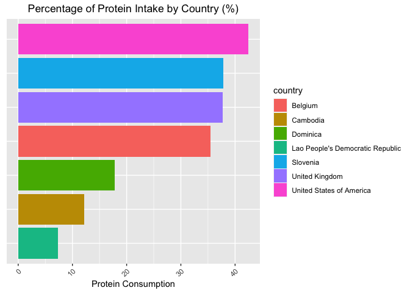
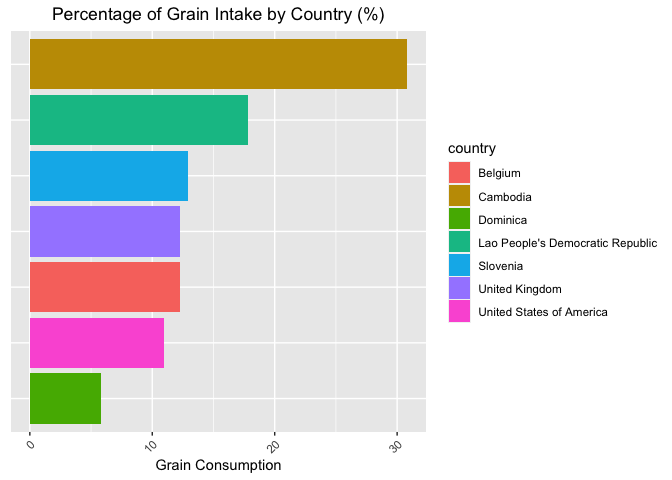
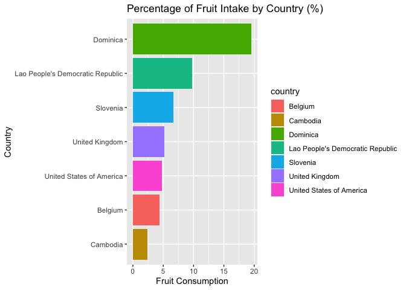
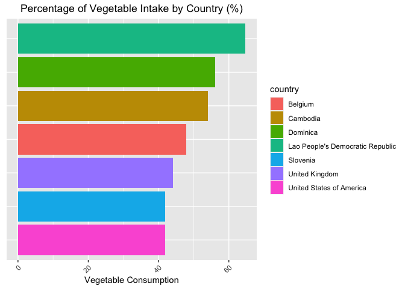
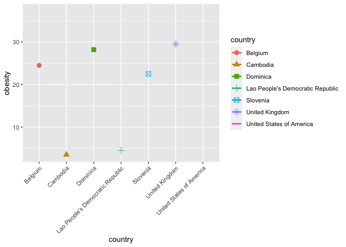
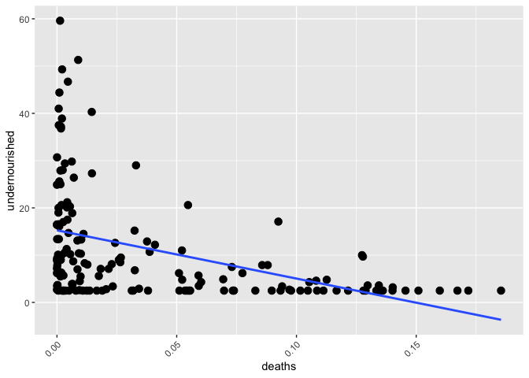
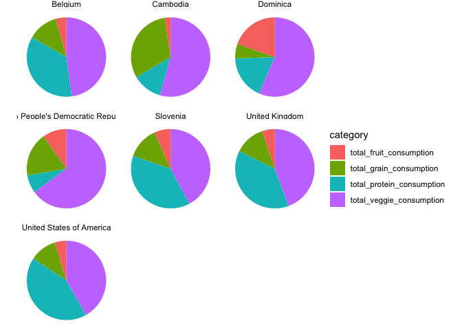

```r
library(tidyverse)
```

```
## ── Attaching packages ─────────────────────────────────────── tidyverse 1.3.0 ──
```

```
## ✓ ggplot2 3.3.3     ✓ purrr   0.3.4
## ✓ tibble  3.1.0     ✓ dplyr   1.0.4
## ✓ tidyr   1.1.2     ✓ stringr 1.4.0
## ✓ readr   1.4.0     ✓ forcats 0.5.1
```

```
## ── Conflicts ────────────────────────────────────────── tidyverse_conflicts() ──
## x dplyr::filter() masks stats::filter()
## x dplyr::lag()    masks stats::lag()
```

```r
library(janitor)
```

```
## 
## Attaching package: 'janitor'
```

```
## The following objects are masked from 'package:stats':
## 
##     chisq.test, fisher.test
```

```r
library(here)
```

```
## here() starts at /Users/margaritaibarra/Desktop/BIS15L-Group-2-Final-Project
```

```r
options(scipen=999) #disables scientific notation when printing
```

###Loading the Data

```r
food_supply <- readr::read_csv("data/Food_Supply_Quantity_kg_Data.csv")
```

```
## 
## ── Column specification ────────────────────────────────────────────────────────
## cols(
##   .default = col_double(),
##   Country = col_character(),
##   Undernourished = col_character(),
##   `Unit (all except Population)` = col_character()
## )
## ℹ Use `spec()` for the full column specifications.
```
###Cleaning the Data

```r
food_supply_clean <- janitor::clean_names(food_supply)
food_supply_clean
```

```
## # A tibble: 170 x 32
##    country      alcoholic_bevera… animal_fats animal_products aquatic_products_…
##    <chr>                    <dbl>       <dbl>           <dbl>              <dbl>
##  1 Afghanistan             0.0014      0.197             9.43             0     
##  2 Albania                 1.67        0.136            18.8              0     
##  3 Algeria                 0.271       0.0282            9.63             0     
##  4 Angola                  5.81        0.056             4.93             0     
##  5 Antigua and…            3.58        0.0087           16.7              0     
##  6 Argentina               4.27        0.223            19.3              0     
##  7 Armenia                 0.401       0.183            13.6              0     
##  8 Australia               5.54        0.314            21.4              0.0033
##  9 Austria                 7.02        0.856            19.6              0.0011
## 10 Azerbaijan              3.60        0.254            11.6              0     
## # … with 160 more rows, and 27 more variables: cereals_excluding_beer <dbl>,
## #   eggs <dbl>, fish_seafood <dbl>, fruits_excluding_wine <dbl>, meat <dbl>,
## #   milk_excluding_butter <dbl>, miscellaneous <dbl>, offals <dbl>,
## #   oilcrops <dbl>, pulses <dbl>, spices <dbl>, starchy_roots <dbl>,
## #   stimulants <dbl>, sugar_sweeteners <dbl>, sugar_crops <dbl>,
## #   treenuts <dbl>, vegetable_oils <dbl>, vegetables <dbl>,
## #   vegetal_products <dbl>, obesity <dbl>, undernourished <chr>,
## #   confirmed <dbl>, deaths <dbl>, recovered <dbl>, active <dbl>,
## #   population <dbl>, unit_all_except_population <chr>
```
###Viewing the Data

```r
glimpse(food_supply_clean)
```

```
## Rows: 170
## Columns: 32
## $ country                    <chr> "Afghanistan", "Albania", "Algeria", "Angol…
## $ alcoholic_beverages        <dbl> 0.0014, 1.6719, 0.2711, 5.8087, 3.5764, 4.2…
## $ animal_fats                <dbl> 0.1973, 0.1357, 0.0282, 0.0560, 0.0087, 0.2…
## $ animal_products            <dbl> 9.4341, 18.7684, 9.6334, 4.9278, 16.6613, 1…
## $ aquatic_products_other     <dbl> 0.0000, 0.0000, 0.0000, 0.0000, 0.0000, 0.0…
## $ cereals_excluding_beer     <dbl> 24.8097, 5.7817, 13.6816, 9.1085, 5.9960, 8…
## $ eggs                       <dbl> 0.2099, 0.5815, 0.5277, 0.0587, 0.2274, 0.9…
## $ fish_seafood               <dbl> 0.0350, 0.2126, 0.2416, 1.7707, 4.1489, 0.4…
## $ fruits_excluding_wine      <dbl> 5.3495, 6.7861, 6.3801, 6.0005, 10.7451, 6.…
## $ meat                       <dbl> 1.2020, 1.8845, 1.1305, 2.0571, 5.6888, 7.0…
## $ milk_excluding_butter      <dbl> 7.5828, 15.7213, 7.6189, 0.8311, 6.3663, 10…
## $ miscellaneous              <dbl> 0.0728, 0.1123, 0.1671, 0.1165, 0.7139, 0.0…
## $ offals                     <dbl> 0.2057, 0.2324, 0.0870, 0.1550, 0.2219, 0.3…
## $ oilcrops                   <dbl> 0.0700, 0.9377, 0.3493, 0.4186, 0.2172, 0.0…
## $ pulses                     <dbl> 0.2953, 0.2380, 0.4783, 0.6507, 0.1840, 0.0…
## $ spices                     <dbl> 0.0574, 0.0008, 0.0557, 0.0009, 0.1524, 0.0…
## $ starchy_roots              <dbl> 0.8802, 1.8096, 4.1340, 18.1102, 1.4522, 3.…
## $ stimulants                 <dbl> 0.3078, 0.1055, 0.2216, 0.0508, 0.1564, 0.4…
## $ sugar_sweeteners           <dbl> 1.3489, 1.5367, 1.8342, 1.8495, 3.8749, 3.0…
## $ sugar_crops                <dbl> 0.0000, 0.0000, 0.0000, 0.0000, 0.0000, 0.0…
## $ treenuts                   <dbl> 0.0770, 0.1515, 0.1152, 0.0061, 0.0253, 0.0…
## $ vegetable_oils             <dbl> 0.5345, 0.3261, 1.0310, 0.6463, 0.8102, 0.9…
## $ vegetables                 <dbl> 6.7642, 11.7753, 11.6484, 2.3041, 5.4495, 4…
## $ vegetal_products           <dbl> 40.5645, 31.2304, 40.3651, 45.0722, 33.3233…
## $ obesity                    <dbl> 4.5, 22.3, 26.6, 6.8, 19.1, 28.5, 20.9, 30.…
## $ undernourished             <chr> "29.8", "6.2", "3.9", "25", NA, "4.6", "4.3…
## $ confirmed                  <dbl> 0.142134196, 2.967300916, 0.244897085, 0.06…
## $ deaths                     <dbl> 0.0061857789, 0.0509513742, 0.0065581532, 0…
## $ recovered                  <dbl> 0.123373921, 1.792635659, 0.167572198, 0.05…
## $ active                     <dbl> 0.0125744965, 1.1237138830, 0.0707667335, 0…
## $ population                 <dbl> 38928000, 2838000, 44357000, 32522000, 9800…
## $ unit_all_except_population <chr> "%", "%", "%", "%", "%", "%", "%", "%", "%"…
```

```r
summary(food_supply_clean)
```

```
##    country          alcoholic_beverages  animal_fats      animal_products 
##  Length:170         Min.   : 0.0000     Min.   :0.00100   Min.   : 1.739  
##  Class :character   1st Qu.: 0.8956     1st Qu.:0.04022   1st Qu.: 7.237  
##  Mode  :character   Median : 2.8662     Median :0.11685   Median :12.098  
##                     Mean   : 3.0230     Mean   :0.22106   Mean   :12.182  
##                     3rd Qu.: 4.7110     3rd Qu.:0.25390   3rd Qu.:16.444  
##                     Max.   :15.3706     Max.   :1.35590   Max.   :26.887  
##                                                                           
##  aquatic_products_other cereals_excluding_beer      eggs       
##  Min.   :0.00000        Min.   : 3.401         Min.   :0.0239  
##  1st Qu.:0.00000        1st Qu.: 7.227         1st Qu.:0.1876  
##  Median :0.00000        Median :10.143         Median :0.4602  
##  Mean   :0.01399        Mean   :11.800         Mean   :0.4706  
##  3rd Qu.:0.00140        3rd Qu.:15.149         3rd Qu.:0.6442  
##  Max.   :1.67940        Max.   :29.805         Max.   :1.6960  
##                                                                
##   fish_seafood    fruits_excluding_wine      meat       milk_excluding_butter
##  Min.   :0.0342   Min.   : 0.6596       Min.   :0.356   Min.   : 0.0963      
##  1st Qu.:0.5571   1st Qu.: 3.5419       1st Qu.:1.891   1st Qu.: 2.1723      
##  Median :1.0292   Median : 5.0213       Median :3.425   Median : 5.3369      
##  Mean   :1.3872   Mean   : 5.6214       Mean   :3.376   Mean   : 6.5198      
##  3rd Qu.:1.8213   3rd Qu.: 6.8277       3rd Qu.:4.422   3rd Qu.:10.4071      
##  Max.   :8.7959   Max.   :19.3028       Max.   :8.170   Max.   :20.8378      
##                                                                              
##  miscellaneous         offals          oilcrops           pulses      
##  Min.   :0.00000   Min.   :0.0000   Min.   : 0.0098   Min.   :0.0000  
##  1st Qu.:0.03232   1st Qu.:0.1051   1st Qu.: 0.1341   1st Qu.:0.1296  
##  Median :0.19685   Median :0.1668   Median : 0.3266   Median :0.3008  
##  Mean   :0.44312   Mean   :0.1934   Mean   : 0.8181   Mean   :0.5371  
##  3rd Qu.:0.58362   3rd Qu.:0.2286   3rd Qu.: 0.6917   3rd Qu.:0.7349  
##  Max.   :3.66340   Max.   :1.2256   Max.   :12.1763   Max.   :3.4838  
##                                                                       
##      spices        starchy_roots       stimulants      sugar_sweeteners
##  Min.   :0.00000   Min.   : 0.6796   Min.   :0.00420   Min.   :0.3666  
##  1st Qu.:0.01650   1st Qu.: 2.0238   1st Qu.:0.08332   1st Qu.:1.7210  
##  Median :0.04255   Median : 3.1086   Median :0.15945   Median :2.6016  
##  Mean   :0.09101   Mean   : 5.3354   Mean   :0.20195   Mean   :2.7991  
##  3rd Qu.:0.12315   3rd Qu.: 5.7459   3rd Qu.:0.26180   3rd Qu.:3.7822  
##  Max.   :0.66260   Max.   :27.7128   Max.   :1.28230   Max.   :9.7259  
##                                                                        
##   sugar_crops         treenuts       vegetable_oils     vegetables    
##  Min.   :0.00000   Min.   :0.00000   Min.   :0.0915   Min.   : 0.857  
##  1st Qu.:0.00000   1st Qu.:0.02075   1st Qu.:0.5077   1st Qu.: 3.616  
##  Median :0.00000   Median :0.07995   Median :0.7744   Median : 5.028  
##  Mean   :0.09585   Mean   :0.11747   Mean   :0.8516   Mean   : 6.086  
##  3rd Qu.:0.00000   3rd Qu.:0.14865   3rd Qu.:1.0709   3rd Qu.: 7.802  
##  Max.   :3.06770   Max.   :0.75690   Max.   :2.2026   Max.   :19.299  
##                                                                       
##  vegetal_products    obesity      undernourished       confirmed        
##  Min.   :23.11    Min.   : 2.10   Length:170         Min.   : 0.000312  
##  1st Qu.:33.55    1st Qu.: 8.50   Class :character   1st Qu.: 0.140976  
##  Median :37.90    Median :21.20   Mode  :character   Median : 1.011570  
##  Mean   :37.81    Mean   :18.71                      Mean   : 2.021972  
##  3rd Qu.:42.76    3rd Qu.:25.70                      3rd Qu.: 3.487069  
##  Max.   :48.26    Max.   :45.60                      Max.   :10.408199  
##                   NA's   :3                          NA's   :6          
##      deaths           recovered           active          population        
##  Min.   :0.000000   Min.   :0.00000   Min.   :0.00000   Min.   :     54000  
##  1st Qu.:0.002013   1st Qu.:0.09911   1st Qu.:0.01203   1st Qu.:   2816250  
##  Median :0.011998   Median :0.47540   Median :0.08104   Median :  10181500  
##  Mean   :0.039370   Mean   :1.45236   Mean   :0.53516   Mean   :  44523641  
##  3rd Qu.:0.069503   3rd Qu.:2.62287   3rd Qu.:0.35818   3rd Qu.:  32716250  
##  Max.   :0.185428   Max.   :9.03987   Max.   :8.01982   Max.   :1402385000  
##  NA's   :6          NA's   :6         NA's   :8                             
##  unit_all_except_population
##  Length:170                
##  Class :character          
##  Mode  :character          
##                            
##                            
##                            
## 
```


```r
food_supply_clean %>%
  naniar::miss_var_summary()
```

```
## # A tibble: 32 x 3
##    variable            n_miss pct_miss
##    <chr>                <int>    <dbl>
##  1 active                   8     4.71
##  2 undernourished           7     4.12
##  3 confirmed                6     3.53
##  4 deaths                   6     3.53
##  5 recovered                6     3.53
##  6 obesity                  3     1.76
##  7 country                  0     0   
##  8 alcoholic_beverages      0     0   
##  9 animal_fats              0     0   
## 10 animal_products          0     0   
## # … with 22 more rows
```
###Analysis

```r
food_supply_clean %>%
  select(country, deaths, population) %>%
  arrange(desc(deaths)) %>% 
  head(n=3)
```

```
## # A tibble: 3 x 3
##   country        deaths population
##   <chr>           <dbl>      <dbl>
## 1 Belgium         0.185   11515000
## 2 Slovenia        0.172    2103000
## 3 United Kingdom  0.167   67160000
```

```r
food_supply_clean %>%
  select(country, deaths, population) %>%
  arrange((deaths)) %>% 
  head(n=3)
```

```
## # A tibble: 3 x 3
##   country                          deaths population
##   <chr>                             <dbl>      <dbl>
## 1 Cambodia                              0   15497000
## 2 Dominica                              0      72000
## 3 Lao People's Democratic Republic      0    7242000
```

***Total Protein Consumption by Country, Focusing on those with the Three HIGHEST Death Percentages**

```r
food_supply_clean %>%
  filter(country=="Belgium"| country=="Slovenia"| country=="United Kingdom") %>%
  group_by(country, deaths, population) %>%
  summarize(total_protein_consumption = sum(animal_fats, animal_products, aquatic_products_other, eggs, fish_seafood, meat, milk_excluding_butter, offals))%>%
  arrange(desc(total_protein_consumption))
```

```
## `summarise()` has grouped output by 'country', 'deaths'. You can override using the `.groups` argument.
```

```
## # A tibble: 3 x 4
## # Groups:   country, deaths [3]
##   country        deaths population total_protein_consumption
##   <chr>           <dbl>      <dbl>                     <dbl>
## 1 Slovenia        0.172    2103000                      37.8
## 2 United Kingdom  0.167   67160000                      37.8
## 3 Belgium         0.185   11515000                      35.5
```

***Total Protein Consumption by Country, Focusing on those with the Three LOWEST Death Percentages**

```r
food_supply_clean %>%
  filter(country=="Cambodia"| country=="Dominica"| country=="Lao People's Democratic Republic") %>%
  group_by(country, deaths, population) %>%
  summarize(total_protein_consumption = sum(animal_fats, animal_products, aquatic_products_other, eggs, fish_seafood, meat, milk_excluding_butter, offals)) %>%
  arrange(-desc(total_protein_consumption))
```

```
## `summarise()` has grouped output by 'country', 'deaths'. You can override using the `.groups` argument.
```

```
## # A tibble: 3 x 4
## # Groups:   country, deaths [3]
##   country                          deaths population total_protein_consumption
##   <chr>                             <dbl>      <dbl>                     <dbl>
## 1 Lao People's Democratic Republic      0    7242000                      7.32
## 2 Cambodia                              0   15497000                     12.2 
## 3 Dominica                              0      72000                     17.8
```
***Total Protein Consumption by Country, Focusing on those with the United States' Death Percentages***

```r
food_supply_clean %>%
  filter(country=="United States of America") %>%
  group_by(country, deaths, population) %>%
  summarize(total_protein_consumption = sum(animal_fats, animal_products, aquatic_products_other, eggs, fish_seafood, meat, milk_excluding_butter, offals))
```

```
## `summarise()` has grouped output by 'country', 'deaths'. You can override using the `.groups` argument.
```

```
## # A tibble: 1 x 4
## # Groups:   country, deaths [1]
##   country                  deaths population total_protein_consumption
##   <chr>                     <dbl>      <dbl>                     <dbl>
## 1 United States of America  0.140  329878000                      42.5
```

```r
protein_graph<-food_supply_clean %>%
  filter(country=="Belgium"| country=="Slovenia"| country=="United Kingdom"|country=="Cambodia"| country=="Dominica"| country=="Lao People's Democratic Republic"|country=="United States of America") %>%
  group_by(country) %>%
  summarize(total_protein_consumption = sum(animal_fats, animal_products, aquatic_products_other, eggs, fish_seafood, meat, milk_excluding_butter, offals)) %>%
  ggplot(aes(x=reorder(country, total_protein_consumption), y=total_protein_consumption, fill=country))+
  geom_col()+
  coord_flip()+
  theme(axis.title.y=element_blank(),
        axis.text.y=element_blank(),
        axis.ticks.y=element_blank())+
  labs(title = "Percentage of Protein Intake by Country (%)",
       x=NULL,
       y="Protein Consumption",
       fill = "country")+
  theme(plot.title=element_text(hjust=0.5), axis.text.x = element_text(angle = 45, hjust=1))
protein_graph
```

<!-- -->
higher protein because it's a bigger country...

***Total Grain Consumption by Country, Focusing on those with the Three HIGHEST Death Percentages***

```r
grains_highest <-food_supply_clean %>%
  group_by(country, deaths, population) %>%
  filter( country == "United Kingdom"| country == "Slovenia" | country == "Belgium"  ) %>% 
  summarize(total_grain_consumption = sum(alcoholic_beverages, cereals_excluding_beer, oilcrops, pulses, spices))
```

```
## `summarise()` has grouped output by 'country', 'deaths'. You can override using the `.groups` argument.
```

```r
grains_highest
```

```
## # A tibble: 3 x 4
## # Groups:   country, deaths [3]
##   country        deaths population total_grain_consumption
##   <chr>           <dbl>      <dbl>                   <dbl>
## 1 Belgium         0.185   11515000                    12.3
## 2 Slovenia        0.172    2103000                    12.9
## 3 United Kingdom  0.167   67160000                    12.3
```
***Total Grain Consumption by Country, Focusing on those with the Three LOWEST Death Percentages***

```r
grains_lowest <-food_supply_clean %>%
  group_by(country, deaths, population) %>%
  filter( country == "Cambodia"| country == "Dominica" | country == "Lao People's Democratic Republic") %>% 
  summarize(total_grain_consumption = sum(alcoholic_beverages, cereals_excluding_beer, oilcrops, pulses, spices))
```

```
## `summarise()` has grouped output by 'country', 'deaths'. You can override using the `.groups` argument.
```

```r
grains_lowest
```

```
## # A tibble: 3 x 4
## # Groups:   country, deaths [3]
##   country                          deaths population total_grain_consumption
##   <chr>                             <dbl>      <dbl>                   <dbl>
## 1 Cambodia                              0   15497000                   30.8 
## 2 Dominica                              0      72000                    5.82
## 3 Lao People's Democratic Republic      0    7242000                   17.8
```
***Total Protein Consumption by Country, Focusing on those with the United States' Death Percentages***

```r
grains_us <-food_supply_clean %>%
  group_by(country, deaths, population) %>%
  filter( country == "United States of America") %>% 
  summarize(total_grain_consumption = sum(alcoholic_beverages, cereals_excluding_beer, oilcrops, pulses, spices))
```

```
## `summarise()` has grouped output by 'country', 'deaths'. You can override using the `.groups` argument.
```

```r
grains_us
```

```
## # A tibble: 1 x 4
## # Groups:   country, deaths [1]
##   country                  deaths population total_grain_consumption
##   <chr>                     <dbl>      <dbl>                   <dbl>
## 1 United States of America  0.140  329878000                    10.9
```

```r
grains_graph <-food_supply_clean %>%
  group_by(country) %>%
  filter( country == "Cambodia"| country == "Dominica" | country == "Lao People's Democratic Republic" | country == "United Kingdom"| country == "Slovenia" | country == "Belgium" | country == "United States of America") %>% 
  summarize(total_grain_consumption = sum(alcoholic_beverages, cereals_excluding_beer, oilcrops, pulses, spices)) %>% 
  ggplot(aes(x=reorder(country, total_grain_consumption), y=total_grain_consumption, fill=country))+
  geom_col()+
  coord_flip()+
  theme(axis.title.y=element_blank(),
        axis.text.y=element_blank(),
        axis.ticks.y=element_blank())+
  labs(title = "Percentage of Grain Intake by Country (%)",
       x=NULL,
       y="Grain Consumption",
       fill = "country")+
  theme(plot.title=element_text(hjust=0.5), axis.text.x = element_text(angle = 45, hjust=1))
grains_graph
```

<!-- -->

***Total Fruit Consumption by Country, Focusing on those with the Three HIGHEST Death Percentages***

```r
fruits_highest<-food_supply_clean %>%
  filter(country=="Belgium"| country=="Slovenia"| country=="United Kingdom") %>%
  group_by(country, deaths, population) %>%
  summarize(total_fruit_consumption = sum(fruits_excluding_wine, stimulants),.groups = 'keep') %>%
  arrange(desc(deaths))
fruits_highest
```

```
## # A tibble: 3 x 4
## # Groups:   country, deaths, population [3]
##   country        deaths population total_fruit_consumption
##   <chr>           <dbl>      <dbl>                   <dbl>
## 1 Belgium         0.185   11515000                    4.41
## 2 Slovenia        0.172    2103000                    6.70
## 3 United Kingdom  0.167   67160000                    5.20
```

***Total Fruit Consumption by Country, Focusing on those with the Three LOWEST Death Percentages***

```r
fruits_lowest<-food_supply_clean %>%
  filter(country=="Cambodia"| country=="Dominica"| country=="Lao People's Democratic Republic") %>%
  group_by(country, deaths, population) %>%
  summarize(total_fruit_consumption = sum(fruits_excluding_wine, stimulants),.groups = 'keep') %>%
  arrange(desc(deaths))
fruits_lowest
```

```
## # A tibble: 3 x 4
## # Groups:   country, deaths, population [3]
##   country                          deaths population total_fruit_consumption
##   <chr>                             <dbl>      <dbl>                   <dbl>
## 1 Cambodia                              0   15497000                    2.44
## 2 Dominica                              0      72000                   19.6 
## 3 Lao People's Democratic Republic      0    7242000                    9.80
```

***Total Fruit Consumption by Country, Focusing on those with the United States' Death Percentages***

```r
fruits_us<-food_supply_clean %>%
  filter(country=="United States of America") %>%
  group_by(country, deaths, population) %>%
  summarize(total_fruit_consumption = sum(fruits_excluding_wine, stimulants),
            .groups = 'keep')
fruits_us
```

```
## # A tibble: 1 x 4
## # Groups:   country, deaths, population [1]
##   country                  deaths population total_fruit_consumption
##   <chr>                     <dbl>      <dbl>                   <dbl>
## 1 United States of America  0.140  329878000                    4.79
```

##Fruit Consumption Table

```r
fruits_graph<-food_supply_clean %>%
  filter(country=="Cambodia"| country=="Dominica"| country=="Lao People's Democratic Republic"| country=="United States of America" | country=="Belgium"| country=="Slovenia"| country=="United Kingdom") %>%
  group_by(country) %>%
  summarize(total_fruit_consumption = sum(fruits_excluding_wine, stimulants),.groups = 'keep') %>%
  ggplot(aes(x=reorder(country, total_fruit_consumption), y=total_fruit_consumption, fill=country))+
  geom_col()+
  coord_flip()+
  theme(axis.title.y=element_blank(),
        axis.text.y=element_blank(),
        axis.ticks.y=element_blank())+
  labs(title = "Percentage of Fruit Intake by Country (%)",
       x=NULL,
       y="Fruit Consumption",
       fill = "country")
fruits_graph
```

<!-- -->
#works outside of the "theme" xlab(“”)
***Total Veggies Consumption by Country, Focusing on those with the Three HIGHEST Death Percentages***

```r
veggies_highest <-food_supply_clean %>%
  group_by(country, deaths, population) %>%
  filter(country == "Belgium" | country == "Slovenia" | country == "United Kingdom") %>% 
  summarise(total_veggie_consumption = sum(starchy_roots, sugar_crops, sugar_sweeteners, treenuts, vegetable_oils, vegetables, vegetal_products))
```

```
## `summarise()` has grouped output by 'country', 'deaths'. You can override using the `.groups` argument.
```

```r
veggies_highest
```

```
## # A tibble: 3 x 4
## # Groups:   country, deaths [3]
##   country        deaths population total_veggie_consumption
##   <chr>           <dbl>      <dbl>                    <dbl>
## 1 Belgium         0.185   11515000                     47.8
## 2 Slovenia        0.172    2103000                     41.9
## 3 United Kingdom  0.167   67160000                     44.1
```
***Total Veggies Consumption by Country, Focusing on those with the Three HIGHEST Death Percentages***

```r
veggies_lowest <-food_supply_clean %>%
  group_by(country, deaths, population) %>%
  filter(country == "Cambodia" | country == "Dominica" | country == "Lao People's Democratic Republic") %>% 
  summarise(total_veggie_consumption = sum(starchy_roots, sugar_crops, sugar_sweeteners, treenuts, vegetable_oils, vegetables, vegetal_products))
```

```
## `summarise()` has grouped output by 'country', 'deaths'. You can override using the `.groups` argument.
```

```r
veggies_lowest
```

```
## # A tibble: 3 x 4
## # Groups:   country, deaths [3]
##   country                          deaths population total_veggie_consumption
##   <chr>                             <dbl>      <dbl>                    <dbl>
## 1 Cambodia                              0   15497000                     54.1
## 2 Dominica                              0      72000                     56.1
## 3 Lao People's Democratic Republic      0    7242000                     64.7
```
***Total Veggies Consumption by Country, Focusing on those with the United States' Death Percentages***

```r
veggies_us <-food_supply_clean %>%
  group_by(country, deaths, population) %>%
  filter(country == "United States of America") %>% 
  summarise(total_veggie_consumption = sum(starchy_roots, sugar_crops, sugar_sweeteners, treenuts, vegetable_oils, vegetables, vegetal_products))
```

```
## `summarise()` has grouped output by 'country', 'deaths'. You can override using the `.groups` argument.
```

```r
veggies_us
```

```
## # A tibble: 1 x 4
## # Groups:   country, deaths [1]
##   country                  deaths population total_veggie_consumption
##   <chr>                     <dbl>      <dbl>                    <dbl>
## 1 United States of America  0.140  329878000                     41.8
```


```r
veggies_graph <-food_supply_clean %>%
  group_by(country) %>%
  filter( country == "Cambodia"| country == "Dominica" | country == "Lao People's Democratic Republic" | country == "United Kingdom"| country == "Slovenia" | country == "Belgium" | country == "United States of America") %>%
  summarise(total_veggie_consumption = sum(starchy_roots, sugar_crops, sugar_sweeteners, treenuts, vegetable_oils, vegetables, vegetal_products)) %>% 
  ggplot(aes(x=reorder(country, total_veggie_consumption), y=total_veggie_consumption, fill=country))+
  geom_col()+
  coord_flip()+
  theme(axis.title.y=element_blank(),
        axis.text.y=element_blank(),
        axis.ticks.y=element_blank())+
  labs(title = "Percentage of Vegetable Intake by Country (%)",
       x=NULL,
       y="Vegetable Consumption",
       fill = "country")+
  theme(plot.title=element_text(hjust=0.5), axis.text.x = element_text(angle = 45, hjust=1))
veggies_graph
```

<!-- -->
#mutate each country to fill by letter given to the countries (3 lowest countries will be A and 3 highest countries will be B) or gradient based on value of y axis

***Total Category Consumption of Each Country***

```r
total_food_consumption<-food_supply_clean %>%
  filter(country=="Belgium"| country=="Slovenia"| country=="United Kingdom"|country=="Cambodia"| country=="Dominica"| country=="Lao People's Democratic Republic"|country=="United States of America") %>%
  select(country:obesity, deaths) %>%
  group_by(country, deaths) %>%
  summarize(total_protein_consumption = sum(animal_fats, animal_products, aquatic_products_other, eggs, fish_seafood, meat, milk_excluding_butter, offals),
            total_veggie_consumption = sum(starchy_roots, sugar_crops, sugar_sweeteners, treenuts, vegetable_oils, vegetables, vegetal_products),
            total_fruit_consumption = sum(fruits_excluding_wine, stimulants),
            total_grain_consumption = sum(alcoholic_beverages, cereals_excluding_beer, oilcrops, pulses, spices), .groups = 'keep') %>% 
  arrange(desc(deaths))
total_food_consumption
```

```
## # A tibble: 7 x 6
## # Groups:   country, deaths [7]
##   country        deaths total_protein_cons… total_veggie_cons… total_fruit_cons…
##   <chr>           <dbl>               <dbl>              <dbl>             <dbl>
## 1 Belgium         0.185               35.5                47.8              4.41
## 2 Slovenia        0.172               37.8                41.9              6.70
## 3 United Kingdom  0.167               37.8                44.1              5.20
## 4 United States…  0.140               42.5                41.8              4.79
## 5 Cambodia        0                   12.2                54.1              2.44
## 6 Dominica        0                   17.8                56.1             19.6 
## 7 Lao People's …  0                    7.32               64.7              9.80
## # … with 1 more variable: total_grain_consumption <dbl>
```

***Scattered Plots***

```r
obesity_scatter<-food_supply_clean %>%
  filter(country=="Belgium"| country=="Slovenia"| country=="United Kingdom"|country=="Cambodia"| country=="Dominica"| country=="Lao People's Democratic Republic"|country=="United States of America") %>%
  select(country, obesity, deaths, population) %>%
  group_by(country, obesity) %>%
  ggplot(aes(x=country, y=obesity, color=country, shape=country)) +
  geom_point(size=3) + #geom_smooth(method="lm", se=FALSE)+
  theme(plot.title=element_text(hjust=0.5), axis.text.x = element_text(angle = 45, hjust=1))
obesity_scatter
```

```
## Warning: The shape palette can deal with a maximum of 6 discrete values because
## more than 6 becomes difficult to discriminate; you have 7. Consider
## specifying shapes manually if you must have them.
```

```
## Warning: Removed 1 rows containing missing values (geom_point).
```

<!-- -->

```r
undernourished_scatter<-food_supply_clean %>%
  filter(country=="Belgium"| country=="Slovenia"| country=="United Kingdom"|country=="Cambodia"| country=="Dominica"| country=="Lao People's Democratic Republic"|country=="United States of America") %>%
  #select(country, undernourished, deaths, population) %>%
  group_by(country, undernourished) %>%
  ggplot(aes(x=country, y=undernourished, color=country, shape=country)) +
  geom_point(size=3) + geom_smooth(method="lm", se=FALSE)+
  theme(plot.title=element_text(hjust=0.5), axis.text.x = element_text(angle = 45, hjust=1))
undernourished_scatter
```

```
## `geom_smooth()` using formula 'y ~ x'
```

```
## Warning: The shape palette can deal with a maximum of 6 discrete values because
## more than 6 becomes difficult to discriminate; you have 7. Consider
## specifying shapes manually if you must have them.
```

```
## Warning: Removed 1 rows containing missing values (geom_point).
```

<!-- -->
***Test app***

```r
TFC_long <- total_food_consumption %>%
  pivot_longer(-country,
               names_to = "category",
               values_to = "values")
TFC_long <- TFC_long %>% 
  filter(category != "deaths")
TFC_long
```

```
## # A tibble: 28 x 3
## # Groups:   country [7]
##    country        category                  values
##    <chr>          <chr>                      <dbl>
##  1 Belgium        total_protein_consumption  35.5 
##  2 Belgium        total_veggie_consumption   47.8 
##  3 Belgium        total_fruit_consumption     4.41
##  4 Belgium        total_grain_consumption    12.3 
##  5 Slovenia       total_protein_consumption  37.8 
##  6 Slovenia       total_veggie_consumption   41.9 
##  7 Slovenia       total_fruit_consumption     6.70
##  8 Slovenia       total_grain_consumption    12.9 
##  9 United Kingdom total_protein_consumption  37.8 
## 10 United Kingdom total_veggie_consumption   44.1 
## # … with 18 more rows
```


ui <- dashboardPage( skin="yellow",
  dashboardHeader(title = "Food Categories of Country"),
  dashboardSidebar(disable = T),
  dashboardBody(
  fluidRow(
  box(title = "Country Details", width = 3,
  selectInput("x", "Select Country", choices = c("Afghanistan", "Albania", "Algeria", "Angola", "Antigua and Barbuda", "Argentina", "Armenia", "Australia", "Austria", "Azerbaijan", "Bahamas", "Bangladesh", "Barbados","Belarus", "Belgium", "Belize", "Benin", "Bolivia", "Bosnia and Herzegovina", "Botswana", "Brazil", "Bulgaria", "Burkina Faso", "Cabo Verde", "Cambodia", "Cameroon", "Canada", "Central African Republic", "Chad", "Chile", "China", "Colombia", "Congo", "Costa Rica", "Cote d'Ivoire", "Croatia", "Cuba", "Cyprus", "Czechia", "Denmark", "Djibouti", "Dominica", "Dominican Republic", "Ecuador", "Egypt", "El Salvador", "Estonia", "Eswatini", "Ethiopia", "Fiji", "Finland", "France", "French Polynesia", "Gabon", "Gambia", "Georgia", "Germany", "Ghana", "Greece", "Grenada", "Guatemala", "Guinea", "Guinea-Bissau", "Guyana", "Haiti", "Honduras", "Hungary", "Iceland", "India", "Indonesia", "Iran (Islamic Republic of)", "Iraq", "Ireland", "Israel", "Italy", "Jamaica", "Japan", "Jordan", "Kazakhstan", "Kenya", "Kiribati", "Korea, North", "Korea, South", "Kuwait", "Kyrgyzstan", "Lao People's Democratic Republic", "Latvia", "Lebanon", "Lesotho", "Liberia", "Lithuania", "Luxembourg", "Madagascar", "Malawi", "Malaysia", "Maldives", "Mali", "Malta", "Mauritania", "Mauritius", "Mexico", "Mongolia", "Montenegro", "Morocco", "Mozambique", "Myanmar", "Namibia", "Nepal", "Netherlands", "New Caledonia", "New Zealand", "Nicaragua", "Niger", "Nigeria", "North Macedonia", "Norway", "Oman", "Pakistan", "Panama", "Paraguay", "Peru", "Philippines", "Poland", "Portugal", "Republic of Moldova", "Romania", "Russian Federation", "Rwanda", "Saint Kitts and Nevis", "Saint Lucia", "Saint Vincent and the Grenadines", "Samoa", "Sao Tome and Principe", "Saudi Arabia", "Senegal", "Serbia", "Sierra Leone", "Slovakia", "Slovenia", "Solomon Islands", "South Africa", "Spain", "Sri Lanka", "Sudan", "Suriname", "Sweden", "Switzerland", "Taiwan*", "Tajikistan", "Thailand", "Timor-Leste", "Togo", "Trinidad and Tobago", "Tunisia", "Turkey", "Turkmenistan", "Uganda", "Ukraine", "United Arab Emirates", "United Kingdom", "United Republic of Tanzania", "United States of America", "Uruguay", "Uzbekistan", "Vanuatu", "Venezuela (Bolivarian Republic of)", "Vietnam", "Yemen", "Zambia", "Zimbabwe"), 
              selected = "Afghanistan")),
  box(title = "Country Details", width = 7,
  plotOutput("plot", width = "600px", height = "500px")
  ) 
  ) 
  ) 
)

server <- function(input, output, session) { 
  
  output$plot <- renderPlot({
  country_tfc_long %>%
  filter(country==input$x) %>%
  ggplot(aes(x=category, y=values)) +
  geom_col(fill="blue3", alpha = 0.75, size=4)+
  labs(x="Country", y="Deaths")+
  theme_light(base_size = 18) +
  theme(axis.text.x = element_text(angle = 45, hjust = 1))
  })
  session$onSessionEnded(stopApp)
  }

shinyApp(ui, server)


```r
TFC_long %>% 
  ggplot(aes(x = "", y = values, fill = category))+
  geom_col(stat = "identity", width = 1, position = 'fill')+
  coord_polar(theta = "y")+
  theme(axis.title.y=element_blank(),
        axis.text.y=element_blank(),
        axis.ticks.y=element_blank())+
  facet_wrap(~country) + theme_void()
```

```
## Warning: Ignoring unknown parameters: stat
```

<!-- -->

***PLAY AROUND CODE***

```r
food_supply_clean %>%
  filter(country=="United States of America") %>%
  group_by(country, deaths, population) %>%
  summarize(total_protein_consumption = sum(animal_fats, animal_products, aquatic_products_other, eggs, fish_seafood, meat, milk_excluding_butter, offals),
            total_veggie_consumption = sum(starchy_roots, sugar_crops, sugar_sweeteners, treenuts, vegetable_oils, vegetables, vegetal_products),
            total_fruit_consumption = sum(fruits_excluding_wine, stimulants),
            total_grain_consumption = sum(alcoholic_beverages, cereals_excluding_beer, oilcrops, pulses, spices),
            .groups = 'keep') %>%
  arrange(desc(deaths))
```

```
## # A tibble: 1 x 7
## # Groups:   country, deaths, population [1]
##   country  deaths population total_protein_co… total_veggie_co… total_fruit_con…
##   <chr>     <dbl>      <dbl>             <dbl>            <dbl>            <dbl>
## 1 United …  0.140  329878000              42.5             41.8             4.79
## # … with 1 more variable: total_grain_consumption <dbl>
```


```r
country_tfc<-food_supply_clean %>%
  group_by(country, deaths, population) %>%
  summarize(total_protein_consumption = sum(animal_fats, animal_products, aquatic_products_other, eggs, fish_seafood, meat, milk_excluding_butter, offals),
            total_veggie_consumption = sum(starchy_roots, sugar_crops, sugar_sweeteners, treenuts, vegetable_oils, vegetables, vegetal_products),
            total_fruit_consumption = sum(fruits_excluding_wine, stimulants),
            total_grain_consumption = sum(alcoholic_beverages, cereals_excluding_beer, oilcrops, pulses, spices), .groups = 'keep') %>% 
  arrange(desc(deaths))
country_tfc
```

```
## # A tibble: 170 x 7
## # Groups:   country, deaths, population [170]
##    country  deaths population total_protein_c… total_veggie_co… total_fruit_con…
##    <chr>     <dbl>      <dbl>            <dbl>            <dbl>            <dbl>
##  1 Belgium   0.185   11515000             35.5             47.8             4.41
##  2 Slovenia  0.172    2103000             37.8             41.9             6.70
##  3 United …  0.167   67160000             37.8             44.1             5.20
##  4 Czechia   0.160   10716000             35.6             45.0             3.53
##  5 Italy     0.151   60296000             38.1             43.4             6.32
##  6 Bosnia …  0.146    3281000             24.9             55.4             4.99
##  7 North M…  0.140    2080000             24.1             60.2             5.34
##  8 United …  0.140  329878000             42.5             41.8             4.79
##  9 Portugal  0.136   10255000             37.3             44.5             6.78
## 10 Bulgaria  0.134    6927000             34.5             44.0             4.26
## # … with 160 more rows, and 1 more variable: total_grain_consumption <dbl>
```

```r
country_tfc_long <- country_tfc %>%
  pivot_longer(-country,
               names_to = "category",
               values_to = "values")
country_tfc_long <- country_tfc_long %>% 
  filter(category != "deaths", category != "population")
country_tfc_long
```

```
## # A tibble: 680 x 3
## # Groups:   country [170]
##    country        category                  values
##    <chr>          <chr>                      <dbl>
##  1 Belgium        total_protein_consumption  35.5 
##  2 Belgium        total_veggie_consumption   47.8 
##  3 Belgium        total_fruit_consumption     4.41
##  4 Belgium        total_grain_consumption    12.3 
##  5 Slovenia       total_protein_consumption  37.8 
##  6 Slovenia       total_veggie_consumption   41.9 
##  7 Slovenia       total_fruit_consumption     6.70
##  8 Slovenia       total_grain_consumption    12.9 
##  9 United Kingdom total_protein_consumption  37.8 
## 10 United Kingdom total_veggie_consumption   44.1 
## # … with 670 more rows
```

***Margarita's Stuff***

```r
TFC_long %>% 
  mutate(pct = round(values, digits = 2))
```

```
## # A tibble: 28 x 4
## # Groups:   country [7]
##    country        category                  values   pct
##    <chr>          <chr>                      <dbl> <dbl>
##  1 Belgium        total_protein_consumption  35.5  35.5 
##  2 Belgium        total_veggie_consumption   47.8  47.8 
##  3 Belgium        total_fruit_consumption     4.41  4.41
##  4 Belgium        total_grain_consumption    12.3  12.3 
##  5 Slovenia       total_protein_consumption  37.8  37.8 
##  6 Slovenia       total_veggie_consumption   41.9  41.9 
##  7 Slovenia       total_fruit_consumption     6.70  6.7 
##  8 Slovenia       total_grain_consumption    12.9  12.9 
##  9 United Kingdom total_protein_consumption  37.8  37.8 
## 10 United Kingdom total_veggie_consumption   44.1  44.1 
## # … with 18 more rows
```

```r
cats <- TFC_long$category
cats <- str_replace(cats, c('total_protein_consumption'), replacement = 'Protein')
cats <- str_replace(cats, c('total_veggie_consumption'), replacement = 'Vegetables')
cats <- str_replace(cats, c('total_fruit_consumption'), replacement = 'Fruits')
cats <- str_replace(cats, c('total_grain_consumption'), replacement = 'Grains')
```


```r
TFC_long2 <-TFC_long %>% 
  mutate(cat2 = category) %>% 
  mutate(pct = round(values, digits = 2))

TFC_long2$cat2 <- cats
TFC_long2
```

```
## # A tibble: 28 x 5
## # Groups:   country [7]
##    country        category                  values cat2         pct
##    <chr>          <chr>                      <dbl> <chr>      <dbl>
##  1 Belgium        total_protein_consumption  35.5  Protein    35.5 
##  2 Belgium        total_veggie_consumption   47.8  Vegetables 47.8 
##  3 Belgium        total_fruit_consumption     4.41 Fruits      4.41
##  4 Belgium        total_grain_consumption    12.3  Grains     12.3 
##  5 Slovenia       total_protein_consumption  37.8  Protein    37.8 
##  6 Slovenia       total_veggie_consumption   41.9  Vegetables 41.9 
##  7 Slovenia       total_fruit_consumption     6.70 Fruits      6.7 
##  8 Slovenia       total_grain_consumption    12.9  Grains     12.9 
##  9 United Kingdom total_protein_consumption  37.8  Protein    37.8 
## 10 United Kingdom total_veggie_consumption   44.1  Vegetables 44.1 
## # … with 18 more rows
```


```r
#pies <- TFC_long2 %>% 
 # ggplot(aes(x = "", y = values, fill = cat2))+
  #geom_col(stat = "identity", width = 1, position = 'fill')+
  #coord_polar(theta = "y")+
  #theme(axis.title.y = element_blank(),
   #     axis.text.y = element_blank(),
    #    axis.ticks.y = element_blank())+
  #facet_wrap(~country) + theme_void()+
  #labs(title = "Food Intake by Country")

#pies

#pies+
 # geom_text(aes(label = paste0(pct,
    #                           " (",
  #                             scales::percent(pct / sum(pct)),
   #                            ")")),
    #        position = position_stack(vjust = 0.5))
```

***Mildred's stuff***

#download.file("http://thematicmapping.org/downloads/TM_WORLD_BORDERS_SIMPL-0.3.zip", #destfile="data/world_shape_file.zip")


#system("unzip DATA/world_shape_file.zip")


#world_spdf <- readOGR( 
#  dsn= paste0("C:/Users/mildr/OneDrive/Desktop/BIS15L-Group-2-Final-Project/data/TM_WORLD_BORDERS_SIMPL-0.3.shp"),
#  layer="TM_WORLD_BORDERS_SIMPL-0.3",
#  verbose=FALSE
#)

#shape_food_join <- full_join(world_spdf, food_supply_clean, by="" )
#fullJoinDf <- full_join(tableA,tableB,by=”Customer.ID”)
#View(fullJoinDf)


#library(leaflet)
#library(RColorBrewer)library(rgdal)library(ggplot2)
#library(maps)
#library(rworldmap)
#library(ggmap)


## R Markdown

This is an R Markdown document. Markdown is a simple formatting syntax for authoring HTML, PDF, and MS Word documents. For more details on using R Markdown see <http://rmarkdown.rstudio.com>.

When you click the **Knit** button a document will be generated that includes both content as well as the output of any embedded R code chunks within the document. You can embed an R code chunk like this:


## Including Plots

You can also embed plots, for example:

<!-- -->

Note that the `echo = FALSE` parameter was added to the code chunk to prevent printing of the R code that generated the plot.
